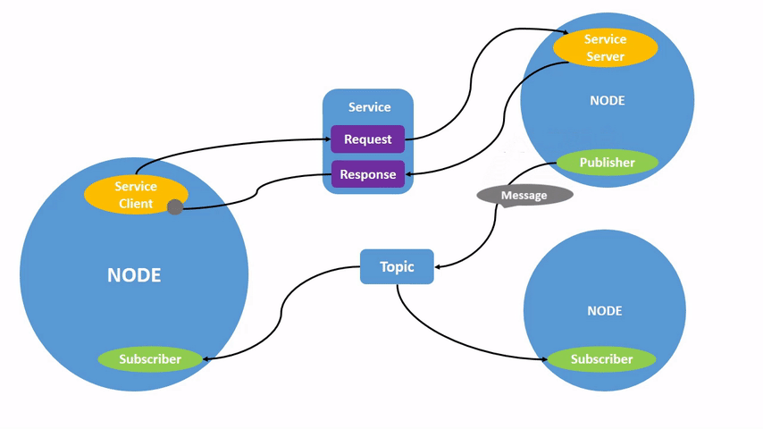

# ROS2 Detailed Notes

# Prerequisites

- Install Virtualbox before workshop / Ubuntu 22 + ROS
- Ideally install and test vm before

### VM Setup

Download the [Virtual Machine Image](https://drive.google.com/drive/folders/1isxQ9GSXstkg4O_Vr5CWbhKsgZS0RCja?usp=drive_link) . This has ROS2 and gazebo.

- Open Virtual Box
- Go to file
- Click Import appliance
- Select the .ova file

VM should be ready (double click on the VM)

- PWD: uqmars USER: uqmars

(optional) Install VM Guest Additions

- Go to devices
- Insert guest additions CD image
- go /media/uqmars/VboxGA
- sudo ./VboxGuestLinux
- Reset our VM

# Introduction

## What is ROS

ROS stands for Robotics Operating System. It is a set of software libraries and tools used in programming robotics systems

It is quite popular and a handy tool to know. It mostly has communication tools and other helpful methods that are invaluable in most robotics programs

## ROS2 Workspace

A workspace is a term for the location where the ROS2 development will take place. You can have multiple workspaces in one system which can make seperating different projects or systems a lot easier

The first task will be creating a workspace for this project. In order to interact with the ros2 system (already installed in the VM) we will need to call this function. It essentially links the terminal with the location of the ROS2 install.

```bash
source /opt/ros/humble/setup.bash
```

Because this would be required every time we want to open a new terminal, we want to avoid this. Therefore, we can add this to the bashrc. This command can accomplish this, but we can edit the file manually too

`echo "source /opt/ros/humble/setup.bashecho "source /opt/ros/humble/setup.bash" >> ~/.bashrc" >> ~/.bashrc`

We can now create a workspace, this is just a folder.

```python
mkdir -p ~/mars_ws/src
```

Before we proceed we can discuss the elements of a ROS2 system.

## ROS2 Architecture

In this tutorial we will discuss the basic elements of a ROS2 architecture. This diagram summarises it



- Node: A ROS2 Node is designed to be responsible for a single modular purpose. Think driving motors or sending sensor data.
  - These can communicate to other nodes via topics or services
- Topic: These are the medium used to exchange messages between nodes.
  - Nodes can send information with a publisher
  - Nodes can access information with a subscriber
- Services: These send messages based on a call-response method. These differ from topics as the request response method requires a client to make a request to a node to obtain a response generated by that node.
  - This is out of scope for this tutorial

There are many other handy ros features such as parameters actions and some other third thing, but this is out of scope. Have a look at the ros2 documentation for more information.

## ROS2 Packages

ROS2 Packages are organisational units. These store executable and other tools used to execute the ros2 code. The python form has some key files:

- package.xml: File containing meta information about the package
- resource/<package_name>: Marker file for the package
- setup.cfg: Links executables to ros
- setup.py: Contains install instructions for deps and some other second thing
- <package_name>: Contains some bullshit file that Is literally empty

In this tute a package called `my_package` will be used to hold our code. Create a package with `ros2 pkg create my_package` inside of the `~/mars_ws/src/` directory.

```python
cd ~/mars_ws/src/
ros2 pkg create my_package
```

This will create all of the files above

## Creating a Publisher

The publisher is the element of the node that sends a message to a topic.

We will put this inside the `~/mars_ws/src/my_package/my_package/` directory. All the solutions are on git

```python
touch my_publisher.py
```

Using a preferred editor, enter in the elements of a publisher.

#Write the code with them

```python
import rclpy
from rclpy.node import Node

from geometry_msgs.msg import Twist

class TwistPublisher(Node):
    def __init__(self):
        # Initialise the node
        super().__init__("twist_publisher")
        # Next, create the publisher element

        # First element: message type, topic name, QOS
        self.twistPub_ = self.create_publisher(Twist, "/cmd_vel", 10);
        # For now send constant velocity command every 0.5 seconds
        # Every 0.5 seconds the timer will call timer_cb
        self.timer_ = self.create_timer(0.5, self.timer_cb)

    def timer_cb(self):
        msg = Twist()
        msg.linear.x = 1.0 #Travel in linear direction of 1 ms
        msg.linear.y = 0.0
        msg.linear.z = 0.0

        msg.angular.x = 0.0
        msg.angular.y = 0.0
        msg.angular.z = 0.0
        # Publish the message
        self.twistPub_.publish(msg)
        # Print something so we know its working
        self.get_logger().info("Sending Twist")

def main(args=None):
    rclpy.init(args=args)
    twistPub = TwistPublisher()
    rclpy.spin(twistPub)
    twistPub.destroy_node()
    rclpy.shutdown()

if __name__ == "__main__":
    main()
```

## Creating a Subscriber

The subscriber receives information from a topic.

Same as publisher except this has a callback function. What do I do when I receive a message:

```python
import rclpy
from rclpy.node import Node

from geometry_msgs.msg import Twist

class TwistSubscriber(Node):

    def __init__(self):
        super().__init__("twist_subscriber")
        self.twistSub_ = self.create_subscription(
            Twist,
            "/cmd_vel",
            self.twist_callback,
            10)
        self.twistSub_ # Without this, we will get a warning

    def twist_callback(self, msg : Twist):
        #The message is a twist message
        #Recieved
        self.get_logger().info("RECIEVED: TWIST %f" %msg.linear.x)

def main(args=None):
    rclpy.init(args=args)
    twistSub = TwistSubscriber()
    rclpy.spin(twistSub)
    twistSub.destroy_node()
    rclpy.shutdown()

if __name__ == "__main__":
    main()
```

### Modifying config files

The config files dictate how ROS2 interacts with the executables.

Modify `[setup.py](http://setup.py)` to

```python
import os
from glob import glob
from setuptools import setup

package_name = 'my_package'

setup(
    name=package_name,
    version='0.0.0',
    packages=[package_name],
    data_files=[
        ('share/ament_index/resource_index/packages',
            ['resource/' + package_name]),
        ('share/' + package_name, ['package.xml']),
        (os.path.join('share', package_name, 'launch'), glob(  os.path.join('launch', '*launch.[pxy][yma]*')))
    ],
    install_requires=['setuptools'],
    zip_safe=True,
    maintainer='uqmars',
    maintainer_email='uqmars@todo.todo',
    description='TODO: Package description',
    license='TODO: License declaration',
    tests_require=['pytest'],
    entry_points={
        'console_scripts': [
            "twist_talker = my_package.my_publisher:main",
            "twist_listener = my_package.my_subscriber:main",
        ],
    },
)
```

Leave `setup.cfg` as default

### Running the ROS2 python with the CLI

Build the files

```python
cd ~/mars_ws/
colcon build
. install/setup.bash
ros2 run my_package my_publisher
```

Open a new terminal

```python
cd ~/mars_ws/
. install/setup.bash
ros2 run my_package my_subscriber
```

## Launch Files

Launch Files allow the execution of multiple nodes at the same time, among other useful features. The following represents a launch file:

```python
cd ~/mars_ws/src/my_package
mkdir launch
cd launch
touch my_launch.launch.py
```

```python
from ament_index_python import get_package_share_directory
from launch import LaunchDescription
from launch_ros.actions import Node

def generate_launch_description():

    # Create the command to launch the listener
    start_listener = Node(
        package="my_package",
        executable="twist_listener",
        name="twist_subsriber"
    )

    start_talker = Node(
        package = "my_package",
        executable = "twist_talker",
        name = "twist_publisher"
    )

    ld = LaunchDescription()
    ld.add_action(start_listener)
    ld.add_action(start_talker)
    return ld
```

```python
cd ~/mars_ws
colcon build
. install/setup.bash
ros2 launch my_package my_launch.launch.py
```

# Simulation

ROS2 also supports interaction with simulators such as Gazebo. Our code we just wrote can be tested on the turtlebot3 simulator.

```python
sudo apt install ros-humble-turtlebot3*
```

```python
export TURTLEBOT3_MODEL=burger
```

```python
	ros2 launch turtlebot3_gazebo turtlebot3_world.launch.py
```

now launch the publisher or the launch file.

# For More Information:

- [ROS2 Documentation](https://docs.ros.org/en/humble/index.html)
- [Robotics Backend](https://roboticsbackend.com/) blogs
- [Automatic Addison](https://automaticaddison.com/)
